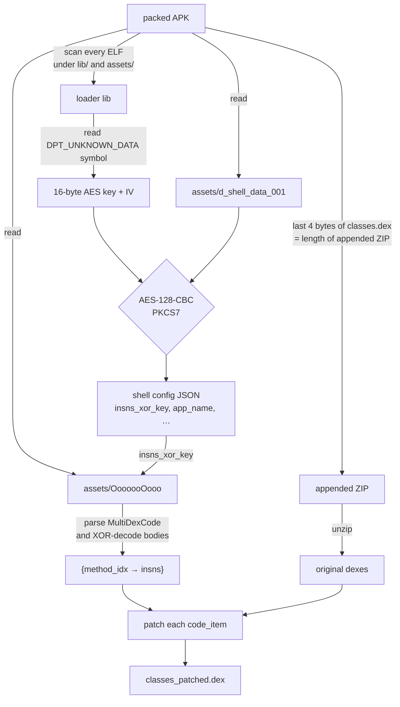

# dpt-unpacker

A tiny Python tool that pulls the real method bodies out of an APK packed with [dpt-shell](https://github.com/luoyesiqiu/dpt-shell).

## Install

```sh
poetry install
```

## Use

```sh
dpt-unpack packed.apk -o out/
baksmali d out/classes_patched.dex -o smali/
```

## How dpt-shell works

When dpt-shell packs an APK it walks every dex, lifts the protected methods' instruction bytes into `assets/OoooooOooo`, and overwrites the originals with either random garbage or repeating `return-void`. The original dex files (`classes.dex`, `classes2.dex`, …) get zipped and appended to a new stub `classes.dex`; the last 4 bytes of that file are a big-endian `u32` pointing at where the appendix starts.

At runtime a native loader (`libdpt.so`) reads the side-store, decodes it with an AES key called `DPT_UNKNOWN_DATA` that lives inside the lib itself, and patches the original bodies back into ART via method-entry hooks. Static analysis sees gibberish; the app still runs.



## License

MIT.
